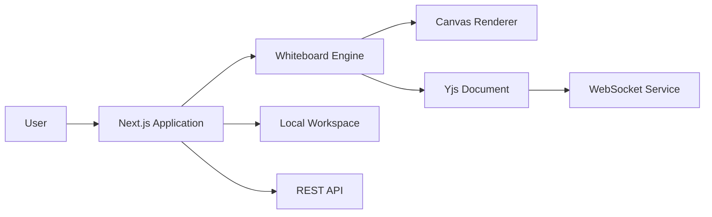

# MyFlow

<p align="center">
  
</p>

<p align="center">
  <strong>A local-first collaborative whiteboard built with Next.js, React, TypeScript, and Yjs.</strong>
</p>

MyFlow is an interactive whiteboard for creating visual flows, sharing them through links, and collaborating with other users in real time.

The frontend is designed around one main principle: **keep whiteboard interactions, UI state, persistence, and collaboration independent from each other.**

---

## High-Level Design



### What each layer does

- **Next.js Application** — routing, room flows, shared-flow pages, modals, toasts, and API integration.
- **Whiteboard Engine** — drawing, selection, movement, resizing, rotation, panning, zooming, hit testing, and geometry.
- **Local Workspace** — keeps the user's editable workspace available locally.
- **REST API** — handles room creation/joining and snapshot-sharing workflows.
- **Yjs + WebSocket** — synchronizes collaborative document changes between room participants.

---

## Whiteboard Architecture

The editor is split into focused interaction logic instead of putting every mouse and keyboard behavior inside one large canvas component.

```text
Pointer / Keyboard Input
          ↓
   Interaction Logic
          ↓
   Whiteboard State
          ↓
    Canvas Renderer
```

The interaction layer handles features such as:

- drawing shapes
- selecting and moving elements
- resizing and rotating elements
- modifier-key resize behavior
- selection boxes
- panning and zooming
- element and handle hit testing
- canvas coordinate conversion

Geometry-heavy operations are kept in utilities so rendering code stays focused on rendering.